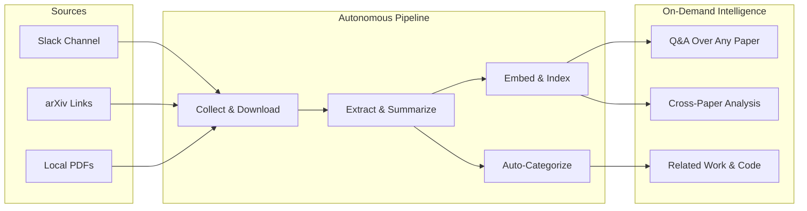

# The Problem: Paper Overload

---

## The Daily Reality

As AI researchers and engineers, we face a familiar set of frustrations:

**Phase Lag - Discovery and Digestion**
We found an interesting paper, skim the abstract, think "I'll read this later," and move on. Within a day, it's buried under 200 messages. Within a week, you've forgotten it exists.

**Manual organization doesn't scale.**
You start a spreadsheet. Or a Notion page. Or a folder of PDFs. It works for 20 papers. At 50, you stop updating it. At 100+, it's abandoned.

**Reading takes too long.**
A single paper is 10-30 pages. When you need to evaluate whether 5 papers are relevant to your current project, that's an afternoon gone -- just for triage.

**Cross-paper insights are invisible.**
"How do recent papers approach continual learning?" To answer this, you'd need to re-read 6 papers, mentally synthesize their approaches, and hold it all in working memory. Nobody does this.

**Related work is scattered.**
Finding a paper's references, related work, and code implementations means jumping between Semantic Scholar, Papers With Code, GitHub, and Google Scholar -- manually, every time.

---

## What We Actually Want

An autonomous system that handles the tedious parts of research paper management, so we can focus on the intellectual work:

---

## The Key Insight

Each of these needs maps to a **multi-step pipeline** that combines different AI capabilities -- embeddings, retrieval, LLM generation, clustering -- into an orchestrated workflow. No single model call solves any of these problems. The value comes from **composing AI components into agentic workflows** that operate autonomously.

This is what Paper Curator does. Let's see how.

---

**Takeaway:** The gap isn't in any single AI capability -- it's in orchestrating multiple capabilities into workflows that solve real problems end-to-end.
