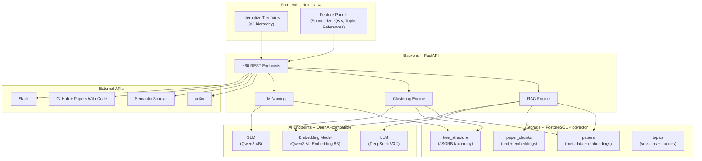

# System Architecture

---

## High-Level Design

Paper Curator is a full-stack application with three layers, connected to external AI and data services:

---

## Design Principles

### 1. OpenAI-Compatible Endpoints

All LLM and embedding calls use the OpenAI API format. This means **any model** can be swapped in -- a local vLLM server, an ngrok tunnel to a remote GPU, or a cloud API -- without changing application code. The system is model-agnostic by design.

### 2. LLM / SLM Split

Not every task needs a large model:

| Task | Model | Why |
|------|-------|-----|
| Summarization, Q&A, structured extraction | **LLM** (DeepSeek-V3.2) | Requires deep comprehension, long context |
| Category naming, abbreviation | **SLM** (Qwen3-4B) | Short output, pattern-matching; runs 10x faster |

This split reduces latency and GPU cost for high-frequency, low-complexity tasks.

### 3. Embeddings as the Universal Glue

Paper embeddings (from Qwen3-VL-Embedding-8B) serve multiple purposes:

- **Classification**: L2-normalized embeddings as input to k-means clustering
- **Retrieval**: cosine similarity search over chunk embeddings for RAG
- **Discovery**: topic search across the entire paper collection
- **Placement**: comparing a new paper's embedding to cluster centroids

One embedding model powers four different agentic workflows.

### 4. pgvector for Unified Storage

Instead of a separate vector database (Pinecone, Qdrant, etc.), embeddings live alongside metadata in PostgreSQL via pgvector. This means:

- No sync issues between metadata and vectors
- Standard SQL for complex queries (joins, filters, aggregation)
- Single backup and deployment target

---

## Configuration Hierarchy

Settings can be tuned at three levels, with higher levels overriding lower:

1. **Runtime overrides** (DB `settings` table, via `POST /config` or the Settings GUI)
2. **Config file** (`config/config.yaml`)
3. **Environment variables** (`PGHOST`, `PGPORT`, etc.)

This allows researchers to adjust parameters (chunk size, branching factor, similarity thresholds) from the UI without restarting the server.

---

**Takeaway:** The architecture is deliberately modular -- any AI model can be swapped in, embeddings serve as the universal glue between workflows, and configuration is adjustable at runtime. This makes it easy to experiment with different models and parameters.
