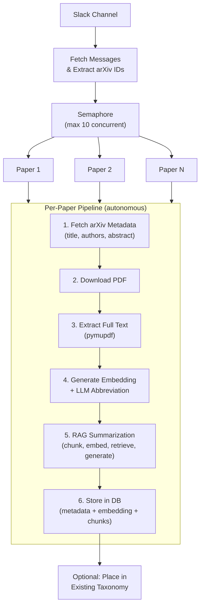

# Ingestion: "Papers Shared on Slack Disappear"

---

## The Need

Our team shares arXiv links on a Slack channel daily. It's the natural place -- someone finds a relevant paper, drops the link, maybe adds a one-line comment. But Slack is a stream, not a database. Within days, those links are effectively lost.

We needed a way to **automatically harvest papers from where we already share them** and turn each link into a fully indexed, searchable, summarized entry -- without any manual data entry.

---

## The Solution: Slack-to-Knowledge Pipeline

Point the system at a Slack channel. It fetches all messages, extracts arXiv IDs, and for each paper, runs a **6-step autonomous pipeline** that produces a fully indexed, summarized, categorized entry.

---

## What Makes This Agentic

This isn't a single API call -- it's an **orchestrated pipeline** where each step depends on the previous one, and different AI capabilities are invoked at different stages:

| Step | Capability Used | What Happens |
|------|----------------|--------------|
| 1 | External API | arXiv metadata fetch (title, authors, abstract) |
| 2 | HTTP download | PDF file retrieval and local storage |
| 3 | Document processing | pymupdf text extraction from PDF |
| 4 | Embedding model + LLM | Generate vector embedding of abstract; LLM creates a short abbreviation (e.g., "TransformerXL" for a paper about Transformer-XL) |
| 5 | RAG pipeline | Chunk the full text, embed each chunk, retrieve relevant chunks, LLM generates summary |
| 6 | Database | Store paper metadata, embedding, and all chunks in PostgreSQL + pgvector |

The system handles **10 papers concurrently** via a semaphore, so a channel with 50 papers completes in minutes, not hours.

---

## Parallel Fan-Out Pattern

The ingestion pipeline demonstrates a key agentic pattern: **fan-out with controlled concurrency**.

- A single trigger (Slack channel URL) produces N independent work items
- Each item runs the same multi-step pipeline autonomously
- A semaphore controls resource usage (LLM endpoint, database connections)
- Failures in one paper don't block others -- each reports its own status

This is the same pattern used in MapReduce, but with LLM calls and embedding generation as the "map" operations.

---

## Input Flexibility

The same pipeline handles three input sources:

| Source | How It Works |
|--------|-------------|
| **Slack channel** | Fetch messages, regex-extract arXiv IDs, run pipeline per ID |
| **arXiv URL/ID** | Direct entry, single paper pipeline |
| **Local directory** | Glob `*.pdf` files, extract title from PDF, run pipeline per file |

The per-paper pipeline is the same regardless of source -- only the "discover papers" step differs.

---

**Takeaway:** An agentic ingestion pipeline turns a passive communication channel (Slack) into an active knowledge pipeline. The fan-out pattern with controlled concurrency makes it practical at scale.
