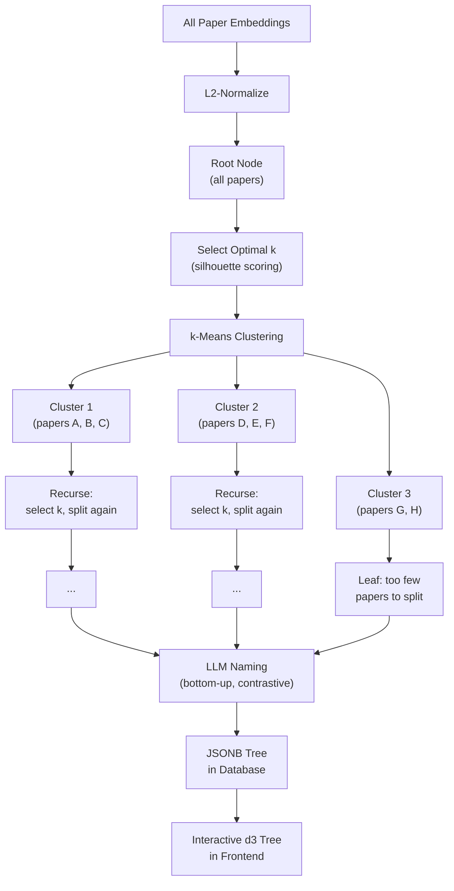
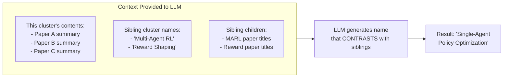

# Classification: "100+ Papers, No Organization"

---

## The Need

Once you have 100+ papers in a database, you need structure. But manual categorization has two problems:

1. **It doesn't scale.** Categorizing 100 papers by hand takes hours, and every new batch means re-doing it.
2. **Categories are subjective.** Two researchers would organize the same papers differently. And as the collection grows, the right categories change.

We needed a system that could **automatically discover a meaningful hierarchical taxonomy** from the papers themselves -- and name the categories in human-readable terms.

---

## The Solution: Embedding Clustering + LLM Naming

The classification pipeline combines **algorithmic clustering** (for structure) with **LLM generation** (for naming). Neither alone would work:

- Clustering without naming produces unlabeled groups ("Cluster 0, 1, 2...")
- LLM naming without clustering would require the LLM to understand hundreds of papers simultaneously



---

## Deep Dive: Silhouette Scoring

A core challenge in clustering: **how many clusters?** Too few and you lump unrelated papers together. Too many and you fragment coherent groups.

### What Silhouette Score Measures

For each paper, the silhouette score compares:

- **a** = average distance to other papers **in the same cluster** (cohesion)
- **b** = average distance to papers in the **nearest other cluster** (separation)
- **silhouette** = (b - a) / max(a, b), ranging from -1 to +1

A high silhouette means clusters are **tight internally and well-separated from each other**.

### How We Use It

At each node in the tree, we try every possible k from 2 to `branching_factor` (default 5):

```
For k in [2, 3, 4, 5]:
    Run k-means with k clusters
    Compute silhouette score across all papers at this node
    
Choose the k with the highest silhouette score
```

This means different parts of the tree can have different branching factors. A node with 3 tightly-separated groups gets k=3. A node where everything is similar stays at k=2. **No manual tuning required.**

### Fallback: BisectingKMeans

Standard k-means can produce empty clusters when the data is skewed. When this happens, the system falls back to **BisectingKMeans** -- a variant that splits clusters recursively and guarantees no empty groups.

---

## Deep Dive: Contrastive LLM Naming

After clustering produces the tree structure, every category needs a **human-readable name**. But naive naming (just describing the papers in a cluster) produces generic labels like "Machine Learning Papers" or "Neural Network Methods."

### The Problem with Naive Naming

If you ask an LLM "Name this group of papers: [paper about RL, paper about MARL, paper about reward shaping]", it might say "Reinforcement Learning." But if there's a sibling cluster that also has RL papers focused on a different aspect, that name is useless -- it doesn't distinguish them.

### Contrastive Context

The solution is to give the LLM **sibling awareness**. When naming a cluster, we provide:



The prompt explicitly instructs:

> "Generate a concise name (2-5 words) that **captures what distinguishes this group from the siblings**. Use standard AI research terminology."

### Bottom-Up Ordering

Naming proceeds **bottom-up** (deepest nodes first), so by the time we name a parent category, all its children already have meaningful names. This makes the naming at every level informed by the structure below it.

### Quality Guards

- Names that start with generic phrases ("Overview", "General", "Miscellaneous") are rejected
- Duplicate names get a disambiguating suffix
- Each name is validated to be 2-5 words, a noun phrase

---

## The Result

A hierarchical taxonomy that:

- Discovers natural groupings from the data itself
- Adapts its branching at each level based on actual separation
- Produces human-readable, distinctive names at every level
- Renders as an interactive tree in the frontend

---

**Takeaway:** The classification pipeline demonstrates the "AI-in-the-loop" pattern -- the algorithm does the structural work (clustering), and the LLM does the semantic work (naming). Contrastive context is the key to producing distinctive, useful category names.
