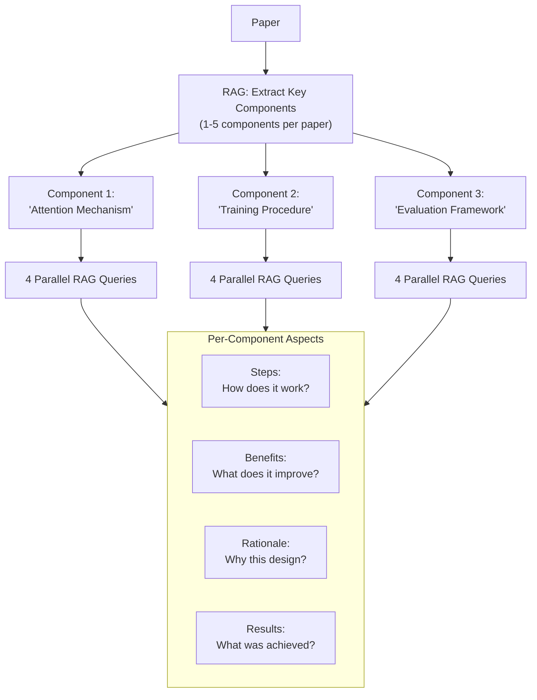

# RAG: "I Don't Have Time to Read 30-Page Papers"

---

## The Need

A typical ML paper is 10-30 pages. When evaluating whether a paper is relevant to your work, you need to understand:

- What problem does it solve?
- What's the core method?
- What results does it achieve?
- How does it compare to alternatives?

Reading the full paper for each of these questions is impractical when you have dozens of candidates. We needed a way to **ask specific questions about any paper and get accurate, grounded answers** -- instantly.

---

## The Solution: Custom RAG Pipeline

We built a Retrieval-Augmented Generation pipeline tailored to academic papers. Unlike generic RAG systems, this one is designed around the structure of research papers and runs entirely within our infrastructure.

### Why Custom Instead of PaperQA2?

We initially used PaperQA2 (a popular library for paper Q&A). We replaced it with a custom pipeline for three reasons:

| Concern | PaperQA2 | Custom RAG |
|---------|----------|------------|
| **Dependencies** | Heavy dependency tree (LiteLLM, many transitive deps) | Minimal: pymupdf, AsyncOpenAI, pgvector |
| **Control** | Black-box retrieval and generation | Full control over chunking, retrieval, prompting |
| **Integration** | Separate index, separate storage | Chunks live in the same PostgreSQL database as everything else |

---

## The Pipeline

```mermaid
flowchart TB
    subgraph indexing ["Indexing (once per paper)"]
        PDF["PDF File"] --> Extract["pymupdf<br/>Text Extraction"]
        Extract --> Chunk["Character Chunking<br/>(5000 chars, 250 overlap)"]
        Chunk --> EmbedChunks["Embed Each Chunk<br/>(batch size 20)"]
        EmbedChunks --> StoreChunks["Store in paper_chunks<br/>(pgvector)"]
        EmbedChunks --> MeanEmbed["Mean of Chunk Embeddings<br/>= Paper Embedding"]
        MeanEmbed --> StorePaper["Store in papers.embedding"]
    end

    subgraph retrieval ["Query (on demand)"]
        Question["User Question"] --> EmbedQ["Embed Question"]
        EmbedQ --> Search["Cosine Similarity Search<br/>in paper_chunks<br/>(top-k, default k=10)"]
        Search --> Context["Assemble Context<br/>(up to ~16k chars)"]
        Context --> Generate["LLM Answer Generation<br/>(grounded in retrieved chunks)"]
        Generate --> Answer["Answer with<br/>Source References"]
    end
```

---

## Chunking Strategy

Academic papers have a specific challenge: sections are long, and key information (a formula, a result, a method description) can span multiple paragraphs. Our chunking approach:

- **Character-based**: 5,000 characters per chunk (not token-based, for simplicity and speed)
- **250-character overlap**: ensures that sentences at chunk boundaries aren't cut mid-thought
- **Per-chunk metadata**: each chunk stores its index, character start/end positions for traceability

Why character-based instead of semantic chunking? Academic writing is dense -- almost every paragraph is information-rich. Semantic chunking (splitting on topic shifts) would produce unevenly sized chunks that complicate retrieval scoring. Fixed-size chunks with overlap are simple, predictable, and work well in practice.

---

## Two Operating Modes

The RAG engine supports two modes, depending on whether the paper is already in the database:

| Mode | When Used | How It Works |
|------|-----------|-------------|
| **DB-backed** | Paper already indexed (chunks in `paper_chunks`) | Embed query, cosine search against stored chunks, retrieve top-k |
| **Ephemeral** | Paper not yet indexed (first-time query) | Chunk and embed in memory, run cosine search in-process, optionally persist chunks to DB |

The ephemeral mode means you can ask a question about a brand-new paper without waiting for a full indexing cycle. If the paper turns out to be important, the chunks are saved to the database for future queries.

---

## Structured Summarization

Beyond simple Q&A, the system can produce **structured summaries** -- multi-aspect breakdowns that capture different dimensions of a paper.

For a paper with 3 key components, this runs **12 RAG queries in parallel** (3 components x 4 aspects) -- producing a comprehensive breakdown in seconds rather than the minutes it would take serially.

---

## Agentic Pattern: Decompose-and-Parallelize

The structured summarization demonstrates a powerful pattern:

1. **Decompose**: Use an LLM to break the task into sub-tasks (extract components)
2. **Parallelize**: Run independent sub-tasks concurrently (4 aspects per component)
3. **Assemble**: Combine results into a structured output

The system decides *what* to analyze (which components matter) and *how* to analyze them (which aspects to extract) -- a form of autonomous task planning.

---

**Takeaway:** RAG isn't just "retrieve and generate." By combining fixed-structure chunking, dual operating modes, and decompose-and-parallelize summarization, the system handles both quick questions and deep analysis over academic papers.
