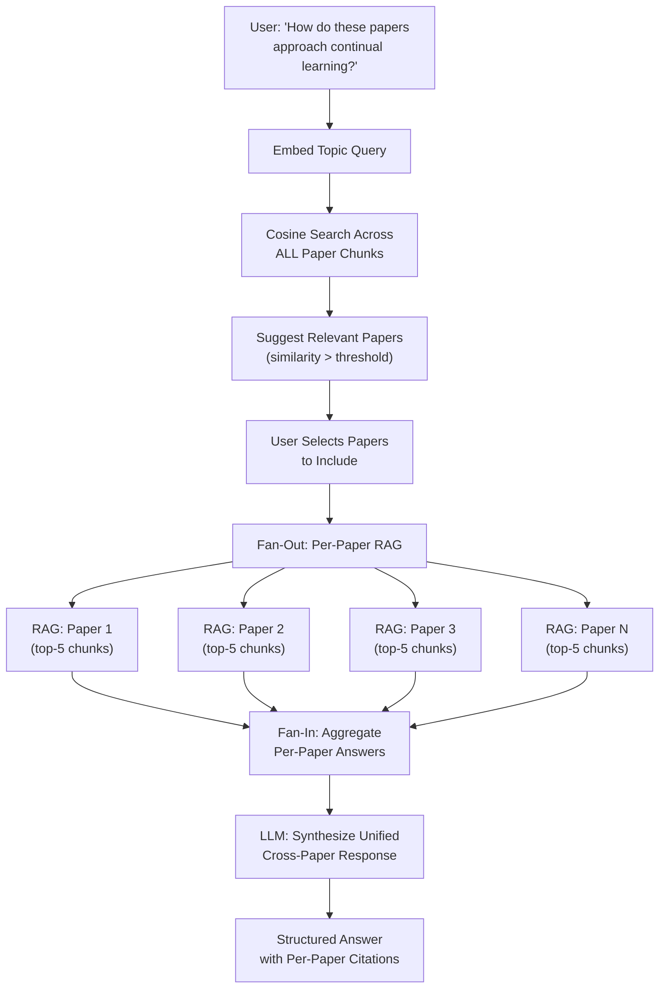

# Topic Query: "What Do Multiple Papers Say About X?"

---

## The Need

Single-paper Q&A is useful, but the most valuable research questions span **multiple papers**:

- "How do recent papers approach continual learning in LLMs?"
- "What evaluation benchmarks are used for multi-agent systems?"
- "Compare the training strategies across these 5 papers."

Answering these requires reading multiple papers, extracting relevant sections from each, and synthesizing a coherent response. This is exactly the kind of tedious, high-value work that an agentic system should handle.

---

## The Solution: Multi-Paper RAG with Topic Sessions

Topic Query extends the single-paper RAG pipeline into a **fan-out / fan-in architecture** that queries multiple papers independently, then aggregates the results.

---

## The Three-Phase Workflow

### Phase 1: Discovery

The user enters a topic (e.g., "continual learning for language models"). The system:

1. Embeds the topic query
2. Searches across **all paper chunks** in the database using cosine similarity
3. Returns papers ranked by relevance, with a configurable similarity threshold (default 0.5)

This gives the user a curated list of potentially relevant papers from their entire collection.

### Phase 2: Curation

The user reviews the suggested papers and selects which ones to include. This is a deliberate **human-in-the-loop** step -- the system proposes, the user decides. The selected papers form the "topic pool."

### Phase 3: Synthesis

For each paper in the pool, the system:

1. Retrieves the top-k most relevant chunks (default k=5) for the topic query
2. Generates a per-paper answer using the RAG pipeline
3. Collects all per-paper answers
4. Runs a final LLM call to **synthesize** a unified response that draws from all papers

A concurrency semaphore (default 3) controls how many papers are queried simultaneously, balancing speed against LLM endpoint capacity.

---

## Topic Sessions

Topics are persistent. A user can:

- Create a topic, select papers, ask an initial question
- Come back later and ask follow-up questions against the same paper pool
- Add or remove papers from the pool as their understanding evolves

This makes Topic Query a **research workspace**, not just a one-shot tool.

---

## Key Configuration

| Parameter | Default | Effect |
|-----------|---------|--------|
| `chunks_per_paper` | 5 | How many chunks to retrieve per paper |
| `similarity_threshold` | 0.5 | Minimum cosine similarity for paper suggestions |
| `max_papers_per_batch` | 10 | Maximum papers in a single topic query |

All configurable at runtime via the Settings GUI.

---

## Agentic Pattern: Fan-Out / Fan-In

This is the same parallel pattern as ingestion, but applied to **retrieval and reasoning**:

- **Fan-out**: N independent RAG queries run concurrently (one per paper)
- **Fan-in**: Results are aggregated and synthesized by a final LLM call

The synthesis step is critical -- without it, you'd just get N separate answers. The final LLM call identifies commonalities, contrasts, and gaps across papers, producing an insight that no single-paper query could provide.

---

**Takeaway:** Multi-paper RAG transforms the system from a paper-level tool into a research-level tool. The fan-out/fan-in pattern enables cross-paper synthesis while keeping each retrieval step focused and accurate.
