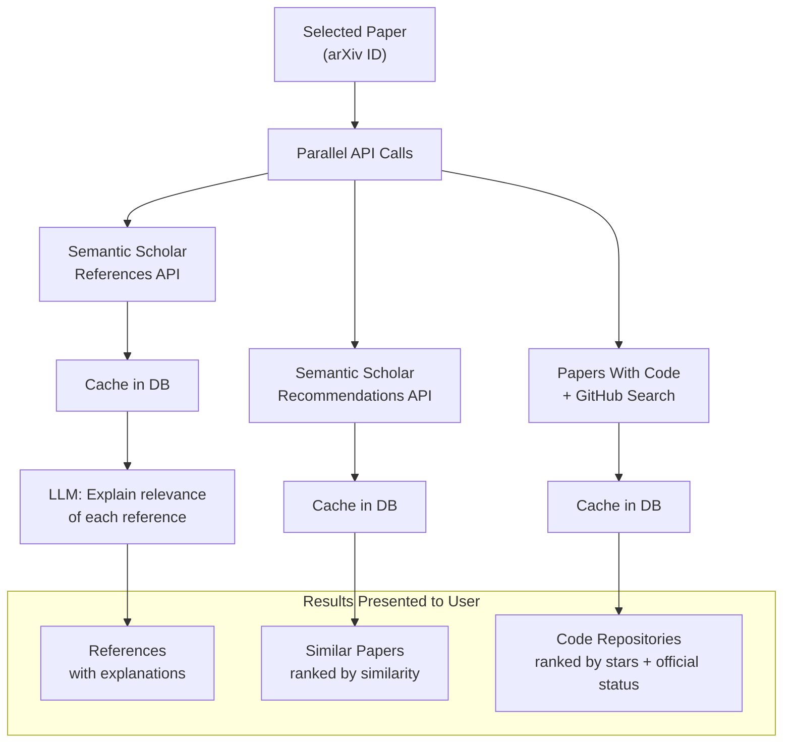

# Discovery: "What Else Should I Read? Is There Code?"

---

## The Need

When you find a relevant paper, three questions immediately follow:

1. **What does this paper cite?** Understanding the references reveals the paper's intellectual lineage and the prior work it builds on.
2. **What similar papers exist?** There might be related work the authors didn't cite, or more recent follow-ups.
3. **Is there an implementation?** Knowing whether code exists (and whether it's the official repo) saves hours of reimplementation.

Answering these manually means jumping between Semantic Scholar, Papers With Code, GitHub, and Google Scholar -- repeatedly, for every paper.

---

## The Solution: Multi-API Orchestration

The system orchestrates three external APIs in parallel, and augments the raw results with LLM-generated explanations:

---

## References with LLM Explanations

Raw reference lists are just titles and authors -- not very useful for deciding what to read next. The system adds a layer of intelligence:

1. Fetch the paper's references from **Semantic Scholar**
2. For each reference, the user can request an **LLM-generated explanation**: "Why did the original paper cite this? What concept or method does it provide?"

The LLM has access to the source paper's abstract and the cited paper's metadata, so it can explain the relationship in context. This turns a flat list of 30+ references into a navigable guide.

---

## Similar Papers

Beyond what the paper explicitly cites, there may be related work published concurrently or after:

- **Semantic Scholar Recommendations**: algorithmically computed similar papers based on content and citation graphs
- **Embedding Similarity**: cosine similarity between paper embeddings in our own database

These two sources complement each other -- Semantic Scholar covers the broader literature, while embedding similarity finds matches within our curated collection.

---

## Code Repository Discovery

For each paper, the system searches for implementations:

| Source | Method | Signal |
|--------|--------|--------|
| **Papers With Code** | Direct lookup by paper title/arXiv ID | Official/community repos linked to the paper |
| **GitHub Search** | Search for paper title, filter by stars | Broader implementations, tutorials, reproductions |

Results are ranked by:
- **Official status**: repos marked as official by authors rank highest
- **Star count**: proxy for code quality and community validation
- **Source**: Papers With Code matches rank above generic GitHub results

---

## Caching Strategy

All discovery results are cached in the database:

- References and similar papers are stored on first fetch
- Subsequent requests for the same paper return cached results instantly
- Cache can be refreshed on demand

This matters because Semantic Scholar has rate limits, and GitHub API has quotas. Caching ensures the system remains responsive even under heavy use.

---

## Agentic Pattern: Enrich-and-Explain

The discovery pipeline demonstrates a pattern of **fetching raw data, then enriching it with AI-generated context**:

1. **Fetch**: Get structured data from external APIs (references, similar papers, repos)
2. **Cache**: Store for reuse and rate-limit protection
3. **Enrich**: Add LLM-generated explanations that make the raw data actionable

The enrichment step transforms data into knowledge -- a reference list becomes a reading guide, and a repo list becomes an implementation roadmap.

---

**Takeaway:** External API orchestration with LLM enrichment turns scattered information sources into a unified discovery experience. Caching makes it practical under API rate limits.
