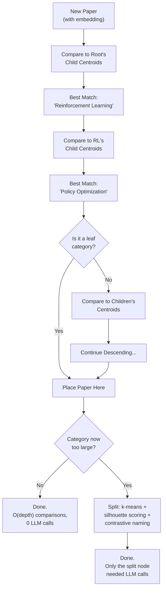

# Incremental Updates: "Don't Rebuild Everything When I Add One Paper"

---

## The Need

The classification pipeline (Section 4) produces excellent hierarchical taxonomies. But it has a cost: a full rebuild requires:

- Re-clustering **all** papers (O(N) embedding comparisons)
- Re-naming **every** category in the tree (O(C) LLM calls, where C = number of categories)

For 100 papers with 30 categories, a full rebuild means 30+ LLM calls just for naming. When you add 3 new papers from today's Slack channel, rebuilding the entire tree is wasteful -- the existing structure is mostly correct, and only a few categories might need adjustment.

---

## The Solution: Incremental Placement

Instead of rebuilding from scratch, new papers are **placed into the existing tree** by navigating the hierarchy using embedding similarity:

---

## How Placement Works

### Step 1: Compute Centroids

Each category in the tree has a **centroid** -- the L2-normalized mean of all paper embeddings in that category. These are computed once after each full rebuild and updated incrementally as papers are added.

### Step 2: Navigate the Tree

Starting at the root, the system compares the new paper's embedding to the centroids of all child categories. It picks the closest match (by cosine similarity) and descends into that subtree. This repeats at each level until reaching a leaf category.

### Step 3: Place or Split

The paper is added to the leaf category. If the category now exceeds a size threshold, it triggers a **local split**:

- Run silhouette-scored k-means on just the papers in that category
- Name only the new sub-categories using contrastive naming
- The rest of the tree is untouched

---

## Cost Comparison

| Operation | Full Rebuild | Incremental Placement |
|-----------|-------------|----------------------|
| Embedding comparisons | All N papers | O(depth) -- typically 3-4 levels |
| Clustering | All papers | Only if a split is needed (rare) |
| LLM naming calls | All C categories | 0 (no split) or 2-5 (one split) |
| Tree disruption | Complete restructure | Only the target leaf changes |
| Time (100 papers, 30 categories) | ~2 minutes | ~2 seconds |

---

## When to Use Each

The system supports both modes, triggered by different actions:

| Mode | Trigger | Use Case |
|------|---------|----------|
| **Full rebuild** | User clicks "Re-categorize" | Periodically, to reset path-dependency drift; or after a major batch ingest |
| **Incremental placement** | Automatic after each paper ingest | Daily additions from Slack, individual paper saves |

The `rebuild_on_ingest` config option (default: `false`) controls whether ingestion triggers a full rebuild or incremental placement. In practice, incremental placement handles daily additions well, and full rebuilds are reserved for periodic reorganization.

### Why Full Rebuilds Are Still Needed: Path Dependency

Incremental placement is **path-dependent** -- the resulting tree depends on the *order* papers were ingested, not just the set. When paper A arrives first, it shifts the centroid of the cluster it joins. When paper B arrives later, it sees a different centroid landscape than if it had arrived first. Over time, the tree drifts: the same collection of papers, ingested in a different order, would produce a different taxonomy.

Full rebuild is **order-independent**. Given the same set of papers, k-means with `random_state=42` + silhouette scoring always produces the same tree. It "resets" the accumulated path-dependency artifacts and finds the globally optimal clustering for the current collection.

This is the primary reason to periodically run a full rebuild -- not because the incremental tree is wrong, but because it may have drifted from the structure that best represents the collection as a whole.

---

## Dirty Tracking

When incremental placement modifies a category (adds a paper, splits a node), that node is marked as **dirty**. This enables a middle ground: **partial re-categorization**, where only dirty subtrees are re-clustered and re-named. This is cheaper than a full rebuild but more thorough than pure placement.

---

## Agentic Pattern: Adaptive Cost

This pipeline adapts its computational cost to the scale of the change:

- **Small change** (1-3 papers): O(depth) comparisons, 0 LLM calls
- **Medium change** (split needed): O(depth) + one local clustering + 2-5 LLM calls
- **Large change** (full rebuild): O(N) clustering + O(C) LLM calls

The system automatically chooses the right level of effort. This is a key property of well-designed agentic workflows: **don't do more work than the situation requires.**

---

**Takeaway:** Incremental placement makes the classification system practical for daily use. The adaptive cost pattern -- doing the minimum work needed for each change -- is a general principle for agentic workflows operating on evolving data.
