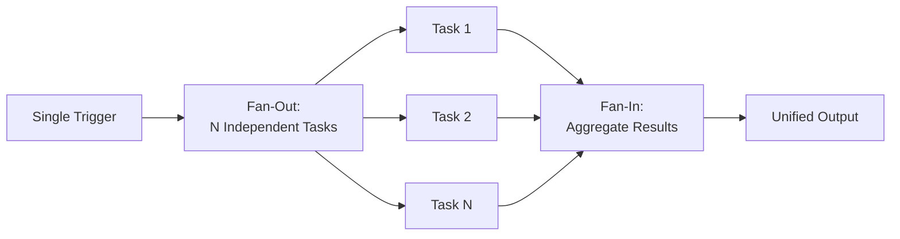

# Reflections: Patterns, Lessons, and What's Next

---

## Recurring Agentic Patterns

Looking across all the features we've built, several design patterns emerge repeatedly. These are general-purpose patterns for building agentic workflows in any domain -- not just paper management.

### Pattern 1: Orchestrated Multi-Step Pipelines

Every feature is a pipeline where each step uses a different capability:

| Feature | Step 1 | Step 2 | Step 3 | Step 4 |
|---------|--------|--------|--------|--------|
| **Ingestion** | Fetch metadata (API) | Extract text (document processing) | Embed (model) | Summarize (LLM) |
| **Classification** | Embed (model) | Cluster (algorithm) | Name (LLM) | Store (DB) |
| **RAG** | Chunk (processing) | Embed (model) | Retrieve (search) | Generate (LLM) |
| **Topic Query** | Embed (model) | Retrieve per paper (search) | Generate per paper (LLM) | Synthesize (LLM) |

No single AI call solves any of these problems. The value comes from **composing capabilities** into end-to-end workflows.

### Pattern 2: Fan-Out / Fan-In

Multiple features use the same parallel execution pattern:

Where this appears:
- **Ingestion**: one Slack channel fans out to N paper pipelines
- **Structured summarization**: one paper fans out to N components x 4 aspects
- **Topic query**: one question fans out to N per-paper RAG queries, then synthesizes

The pattern is always: **single trigger, parallel independent work, aggregated result**.

### Pattern 3: AI-in-the-Loop (Not AI-as-the-System)

A critical design principle: the LLM is a **component**, not the entire system.

- **Clustering** is algorithmic (k-means, silhouette scoring). The LLM only names the results.
- **Retrieval** is vector search (cosine similarity in pgvector). The LLM only generates answers from retrieved context.
- **Placement** is centroid comparison (linear algebra). The LLM only names new categories if a split occurs.

This matters for reliability. Algorithms are deterministic and fast. LLMs are stochastic and slow. By using each where it's strongest, the system is both **reliable** (algorithmic structure) and **intelligent** (LLM semantics).

### Pattern 4: Adaptive Cost

The system adjusts effort to match the task:

| Situation | Work Done |
|-----------|-----------|
| Add 1 paper | O(depth) comparisons, 0 LLM calls |
| Add 1 paper that triggers a split | O(depth) + 1 local clustering + 2-5 LLM calls |
| Full rebuild after major batch | O(N) clustering + O(C) LLM calls |
| Query already-indexed paper | Embed query + search (no chunking needed) |
| Query new paper | Chunk + embed + search + optionally persist |

Well-designed agentic workflows **don't do more work than the situation requires**.

---

## Lessons Learned

### What Worked Well

**Embeddings as the universal glue.** A single embedding model powers classification, retrieval, topic search, and incremental placement. Investing in good embeddings pays dividends across the entire system.

**Contrastive context for LLM tasks.** Whenever the LLM needs to make a choice (naming a category, explaining a reference), giving it **context about alternatives** produces dramatically better results. The LLM doesn't just describe -- it distinguishes.

**Human-in-the-loop at the right granularity.** The system automates tedious steps (downloading, chunking, embedding, clustering) but keeps the user in control at decision points (which papers to include in a topic, when to trigger a full rebuild). Automation and agency aren't all-or-nothing.

**pgvector over dedicated vector databases.** Keeping vectors in PostgreSQL alongside metadata eliminates an entire class of consistency bugs. The trade-off in raw vector search speed is negligible for our scale (hundreds of papers, not millions).

### What's Still Hard

**LLM reliability at scale.** When you make 30+ LLM calls in a classification run, even a 5% failure rate means 1-2 broken category names. Robust error handling and retry logic are essential.

**Chunking is a compromise.** Fixed-size character chunking works, but academic papers have structure (sections, figures, equations) that could inform better chunking. This is an active area for improvement.

**Evaluation is subjective.** How do you measure whether a classification taxonomy is "good"? Or whether a summary captures the right aspects? We rely on user feedback, which is slow and inconsistent.

---

## What's Next

| Direction | Description |
|-----------|-------------|
| **Multi-modal understanding** | Extract and analyze figures, tables, and equations from papers -- not just text |
| **Citation graph analysis** | Build and visualize the citation network across the paper collection |
| **Collaborative features** | Shared annotations, team-level topic queries, discussion threads per paper |
| **Active reading assistance** | Real-time Q&A while reading a paper in the browser, with context-aware suggestions |

---

## Closing Thought

The gap between "AI can do X" and "X is actually useful in my daily work" is almost always an **orchestration gap**. Individual AI capabilities -- generation, embedding, retrieval, classification -- are mature. The challenge is composing them into workflows that solve real problems end-to-end, handle edge cases gracefully, and adapt their effort to the task at hand.

Paper Curator is one example. The patterns -- orchestrated pipelines, fan-out/fan-in, AI-in-the-loop, adaptive cost -- are general. Wherever you see a multi-step knowledge workflow in your daily work, there's likely an agentic system waiting to be built.

---

**Final Takeaway:** The most impactful AI systems aren't the ones with the best models -- they're the ones with the best orchestration. Compose capabilities, automate the tedious, and keep humans in the loop at decision points.
